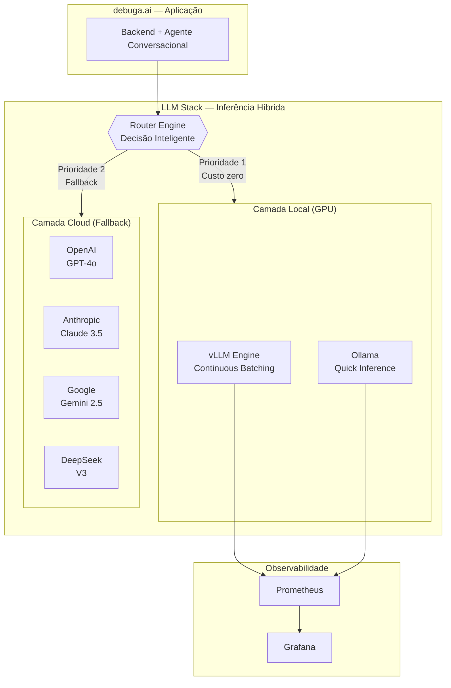
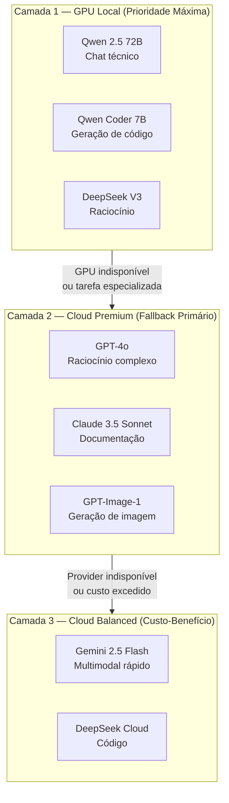
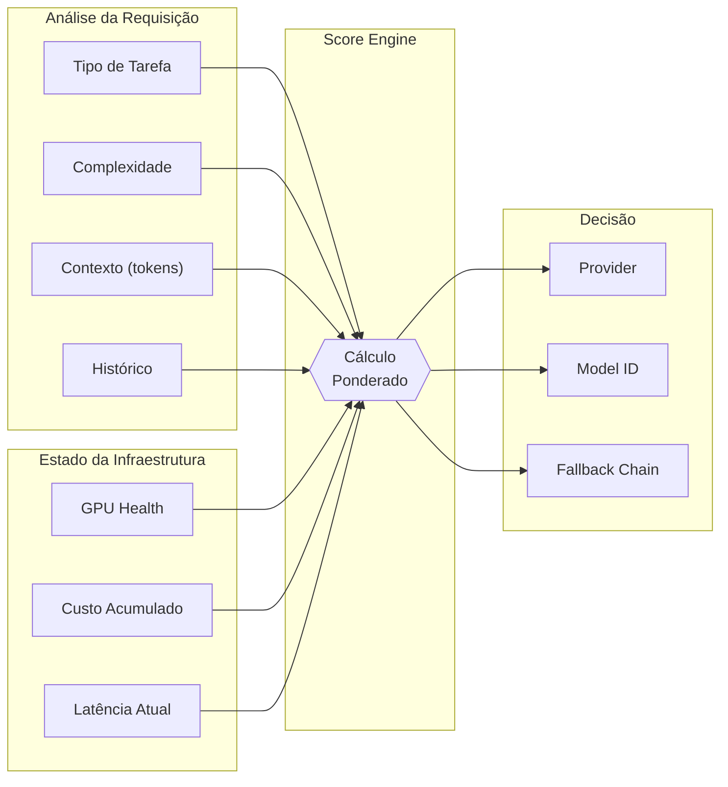
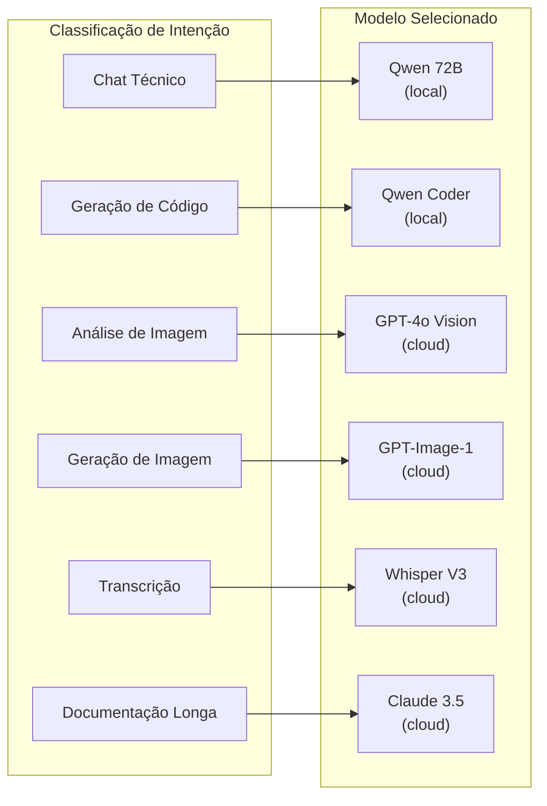
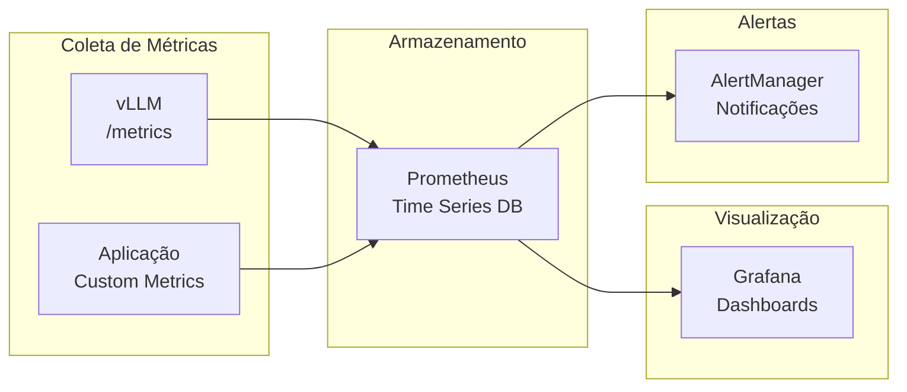

# debuga-llm-stack

**Arquitetura completa da stack de inferência LLM híbrida (GPU local + Cloud) da plataforma [debuga.ai](https://debuga.ai).**

Desenvolvido por [Sperry Tecnologia](https://www.sperrytecnologia.com.br).

---

## Visão Geral

Este repositório documenta a estratégia de inferência multi-camada da debuga.ai: modelos open-source rodando em GPU local (custo zero, dados locais) com fallback automático para providers cloud premium. O resultado é uma plataforma que combina privacidade, performance e qualidade de resposta.



---

## Princípios de Design

| Princípio | Implementação |
|-----------|---------------|
| **Privacidade** | Dados processados localmente por padrão — nunca saem do ambiente sem necessidade |
| **Custo zero** | GPU local elimina custo de inferência para 80%+ das requisições |
| **Resiliência** | Fallback automático transparente — usuário nunca percebe indisponibilidade |
| **Qualidade** | Modelos cloud premium para tarefas que exigem raciocínio superior |
| **Observabilidade** | Métricas de latência, tokens, custo e erros em tempo real |

---

## Arquitetura de Camadas



| Camada | Latência | Custo/1M tokens | Privacidade | Uso |
|--------|----------|-----------------|-------------|-----|
| Local (GPU) | < 2s | $0 | Total | 80% das requisições |
| Cloud Premium | 2-5s | $3-15 | Zero-retention | Tarefas complexas |
| Cloud Balanced | 1-3s | $0.10-1 | Zero-retention | Fallback econômico |

---

## Roteamento Inteligente

O Router Engine decide qual modelo utilizar com base em múltiplos critérios ponderados:



| Critério | Peso | Descrição |
|----------|------|-----------|
| Disponibilidade GPU | **Alto** | Health check da GPU em tempo real |
| Complexidade da tarefa | **Alto** | Classificação automática por intent |
| Tipo de conteúdo | Médio | Código, texto, imagem, áudio, diagrama |
| Custo acumulado | Médio | Dentro dos limites configurados pelo operador |
| Tamanho do contexto | Médio | Modelos locais têm limite de contexto |
| Latência | Baixo | Tempo de resposta aceitável para o tipo de tarefa |

---

## Mapeamento Tarefa → Modelo



| Tarefa | Modelo Primário | Fallback | Justificativa |
|--------|----------------|----------|---------------|
| Chat técnico | Qwen 2.5 72B (local) | GPT-4o | Custo zero + qualidade |
| Geração de código | Qwen Coder 7B (local) | Claude 3.5 | Especializado |
| Raciocínio complexo | GPT-4o | Claude 3.5 | Melhor reasoning |
| Análise de imagem | GPT-4o Vision | Gemini 2.5 | Multimodal avançado |
| Geração de imagem | GPT-Image-1 | — | Qualidade superior |
| Transcrição | Whisper V3 | — | Único provider |
| Documentação longa | Claude 3.5 (200K ctx) | GPT-4o | Contexto extenso |

---

## Hardware de Referência

| Componente | Mínimo | Recomendado | Produção |
|-----------|--------|-------------|----------|
| GPU | RTX 3060 12GB | RTX 3090 24GB | A100 40GB+ |
| RAM | 32 GB | 64 GB | 128 GB |
| Storage | 100 GB SSD | 500 GB NVMe | 1+ TB NVMe |
| CPU | 8 cores | 16 cores | 32+ cores |
| Rede | 100 Mbps | 1 Gbps | 10 Gbps |

---

## Stack de Monitoramento



| Métrica | Descrição | Alerta |
|---------|-----------|--------|
| `vllm_request_latency` | Latência P50/P95/P99 | > 10s P95 |
| `vllm_gpu_utilization` | Uso de VRAM | > 95% |
| `vllm_tokens_per_second` | Throughput de geração | < 20 tok/s |
| `inference_cost_usd` | Custo acumulado cloud | > limite/dia |
| `fallback_rate` | Taxa de fallback para cloud | > 30% |
| `error_rate` | Taxa de erro por provider | > 5% |

---

## Quick Start (Laboratório)

```bash
# 1. Clone o repositório
git clone https://github.com/SperryTecnologia/debuga-llm-stack.git
cd debuga-llm-stack

# 2. Configure variáveis
cp .env.example .env
# Edite .env com seu HF_TOKEN e modelo desejado

# 3. Suba a stack
docker compose up -d

# 4. Verifique saúde
curl http://localhost:8000/health

# 5. Teste inferência
curl http://localhost:8000/v1/chat/completions \
  -H "Content-Type: application/json" \
  -d '{"model": "Qwen/Qwen2.5-Coder-7B-Instruct", "messages": [{"role": "user", "content": "Hello"}]}'

# 6. (Opcional) Suba monitoramento
docker compose --profile monitoring up -d
```

---

## Estrutura do Repositório

```
debuga-llm-stack/
├── docker-compose.yml       # Stack completa (vLLM + monitoramento)
├── monitoring/
│   └── prometheus.yml       # Configuração de scraping
├── diagrams/
│   ├── stack-overview.mmd   # Diagrama da arquitetura
│   └── routing-flow.mmd     # Fluxo de roteamento
├── docs/
│   ├── architecture.md      # Decisões de arquitetura
│   ├── hardware-guide.md    # Guia de hardware
│   ├── integration-vision.md # Visão de integração
│   └── lab-guide.md         # Guia de laboratório
└── README.md
```

---

## Repositórios Relacionados

| Repositório | Descrição |
|-------------|-----------|
| [debuga-ai](https://github.com/SperryTecnologia/debuga-ai) | Plataforma principal |
| [debuga-qwen-coder-lab](https://github.com/SperryTecnologia/debuga-qwen-coder-lab) | Avaliação de modelos para code generation |
| [debuga-vllm-engine](https://github.com/SperryTecnologia/debuga-vllm-engine) | Serving local com vLLM |
| [debuga-llm-gateway](https://github.com/SperryTecnologia/debuga-llm-gateway) | Gateway OpenAI-compatible |

---

## Licença

Documentação e configurações de laboratório sob licença MIT. O código de produção da plataforma é mantido em repositório privado.

---

*Sperry Tecnologia — Infraestrutura, segurança, DevOps e automação com IA.*
