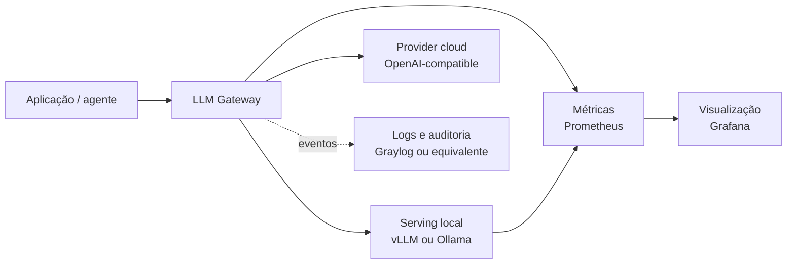

<p align="center">
  
</p>

<h1 align="center">debuga.ai LLM Stack</h1>

<p align="center">
  <strong>Arquitetura pública de referência para inferência híbrida local e cloud</strong>
</p>

<p align="center">
  <a href="https://debuga.ai">Plataforma</a> ·
  <a href="docs/architecture.md">Arquitetura</a> ·
  <a href="docs/lab-guide.md">Laboratório</a> ·
  <a href="docs/hardware-guide.md">Hardware</a> ·
  <a href="SECURITY.md">Segurança</a>
</p>

<p align="center">
  
  
  
  
</p>

---

> [!IMPORTANT]
> Este repositório documenta uma **arquitetura pública de referência** e oferece um
> laboratório genérico. Ele não representa a topologia, os modelos, as credenciais,
> os custos ou os parâmetros vigentes da produção do debuga.ai.

## Visão geral

O `debuga-llm-stack` organiza a visão pública de uma camada de inferência híbrida:
roteamento, serving local, providers OpenAI-compatible, observabilidade e avaliação de
modelos. O objetivo é mostrar como os componentes podem ser separados e homologados sem
expor o core proprietário da plataforma.



## O que este repositório contém

| Área | Conteúdo público | Estado |
|---|---|---|
| Arquitetura | Separação entre aplicação, gateway, engine e providers | Documentado |
| Laboratório | Compose genérico com vLLM e monitoramento opcional | Referência |
| Roteamento | Fluxos e critérios conceituais | Documentado |
| Hardware | Guia inicial para dimensionamento | Estimativa |
| Observabilidade | Prometheus e Grafana como exemplo | Referência |
| Integração | Visão de evolução entre cloud e inferência local | Documentado |

## O que não está incluído

- código proprietário do debuga.ai;
- configuração atual de produção;
- credenciais ou regras comerciais;
- garantia de latência, throughput, custo ou disponibilidade;
- seleção definitiva de modelos;
- automação enterprise de tenant, billing ou compliance.

## Matriz de maturidade

| Capacidade | Classificação | Evidência pública |
|---|---|---|
| Topologia híbrida | Referência | Diagramas e documentação |
| vLLM em laboratório | Exemplo executável | `docker-compose.yml` |
| Monitoramento básico | Exemplo executável | `monitoring/prometheus.yml` |
| Gateway local/cloud | Projeto relacionado | `debuga-llm-gateway` |
| Benchmarks de modelos | Laboratório separado | `debuga-qwen-coder-lab` |
| Serving GPU | Deployment separado | `debuga-vllm-engine` |
| Roteamento por custo/latência | Conceitual | Roadmap e arquitetura |
| SLA e capacidade | Não homologado | Requer teste no ambiente-alvo |

## Quick Start do laboratório

### Pré-requisitos

- Docker e Docker Compose;
- GPU NVIDIA compatível com o modelo selecionado;
- NVIDIA Container Toolkit configurado;
- espaço para o cache do modelo.

```bash
git clone https://github.com/SperryTecnologia/debuga-llm-stack.git
cd debuga-llm-stack
cp .env.example .env
```

Revise o modelo e os limites no `.env`, depois:

```bash
docker compose config
docker compose up -d vllm
docker compose ps
curl -fsS http://localhost:8000/health
```

Monitoramento opcional:

```bash
docker compose --profile monitoring up -d
```

> [!CAUTION]
> O Compose usa imagens de exemplo e expõe portas locais. Fixe versões, proteja endpoints,
> remova senhas padrão e valide o modelo antes de qualquer uso fora do laboratório.

## Critérios de roteamento

Uma implementação real pode considerar:

1. capacidade e saúde do provider;
2. sensibilidade dos dados;
3. tamanho de contexto;
4. tipo e complexidade da tarefa;
5. orçamento configurado;
6. tempo limite e política de fallback.

Esses critérios são uma referência. Percentuais de uso local, preços, latências e modelos
não são universais e devem ser medidos no ambiente-alvo.

## Política para números de desempenho

Qualquer resultado publicado deve registrar pelo menos:

- data e commit;
- modelo e revisão;
- engine e versão;
- GPU, driver e runtime;
- quantização;
- contexto, saída e concorrência;
- dataset ou prompts;
- dados brutos e método de cálculo.

Sem esse conjunto, números são tratados apenas como **estimativas de planejamento**.

## Estrutura

```text
debuga-llm-stack/
├── README.md
├── docker-compose.yml
├── .env.example
├── diagrams/
│   ├── stack-overview.mmd
│   └── routing-flow.mmd
├── docs/
│   ├── README.md
│   ├── architecture.md
│   ├── hardware-guide.md
│   ├── integration-vision.md
│   └── lab-guide.md
└── monitoring/
    └── prometheus.yml
```

## Documentação

| Documento | Finalidade |
|---|---|
| [Arquitetura](docs/architecture.md) | Componentes, limites e fluxo de dados |
| [Guia de laboratório](docs/lab-guide.md) | Sequência de validação controlada |
| [Guia de hardware](docs/hardware-guide.md) | Critérios de dimensionamento |
| [Visão de integração](docs/integration-vision.md) | Evolução gradual local/cloud |
| [Segurança](SECURITY.md) | Relato responsável e cuidados |

## Ecossistema público

| Projeto | Papel |
|---|---|
| [debuga-ai](https://github.com/SperryTecnologia/debuga-ai) | Produto e documentação oficial |
| [debuga-llm-stack](https://github.com/SperryTecnologia/debuga-llm-stack) | Arquitetura de referência |
| [debuga-llm-gateway](https://github.com/SperryTecnologia/debuga-llm-gateway) | Gateway community OpenAI-compatible |
| [debuga-vllm-engine](https://github.com/SperryTecnologia/debuga-vllm-engine) | Serving GPU de referência |
| [debuga-qwen-coder-lab](https://github.com/SperryTecnologia/debuga-qwen-coder-lab) | Avaliação experimental de modelos |

## Licença

Código, configurações e documentação deste repositório estão sob a licença
[Apache License 2.0](LICENSE). Dependências e modelos mantêm suas próprias licenças.

## Sperry Tecnologia

- Plataforma: [debuga.ai](https://debuga.ai)
- Contato: contato@sperrytecnologia.com.br
