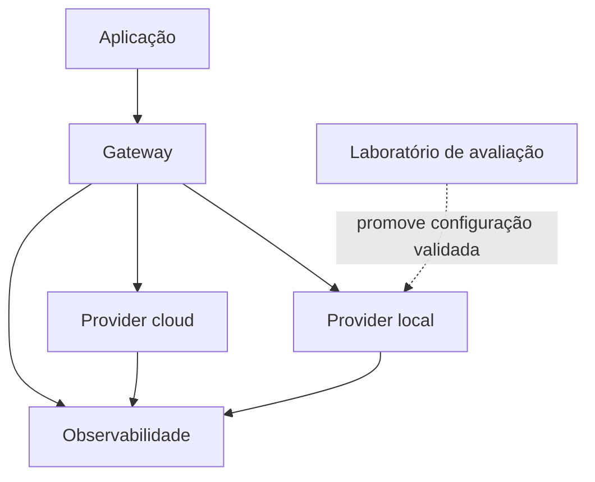
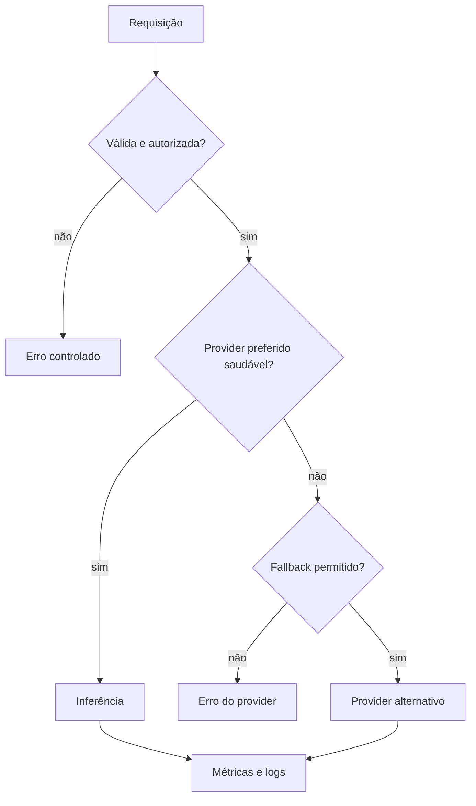

# Arquitetura de referência

## Escopo

A stack separa quatro responsabilidades: aplicação, roteamento, serving e observabilidade.
Essa separação permite trocar providers e engines sem acoplar a aplicação a um único modelo.

## Componentes

### Aplicação

Envia requisições em um contrato estável e trata respostas, streaming e erros.

### Gateway

Centraliza autenticação, seleção de provider, timeout e fallback. O repositório
`debuga-llm-gateway` implementa um subconjunto público dessa função.

### Serving local

Pode usar vLLM, Ollama ou outro endpoint compatível. A escolha depende do modelo,
hardware, licença e carga esperada.

### Provider cloud

Representa qualquer endpoint autorizado e compatível com o contrato configurado.
Privacidade, retenção e custo dependem do provedor e do contrato utilizado.

### Observabilidade

- Prometheus: coleta de métricas;
- Grafana: visualização;
- Graylog ou equivalente: logs, auditoria e eventos operacionais.

## Fluxo de decisão

## Fronteiras de segurança

- endpoints não devem ficar expostos sem autenticação e restrição de rede;
- prompts e respostas podem conter dados sensíveis;
- logs devem evitar segredos e conteúdo desnecessário;
- fallback cloud exige política explícita de dados;
- imagens `latest` devem ser fixadas antes de um ambiente controlado.

## Não objetivos

Esta arquitetura não define SLA, capacidade, modelo obrigatório ou custo universal.
Esses itens dependem de benchmark e homologação no ambiente-alvo.
